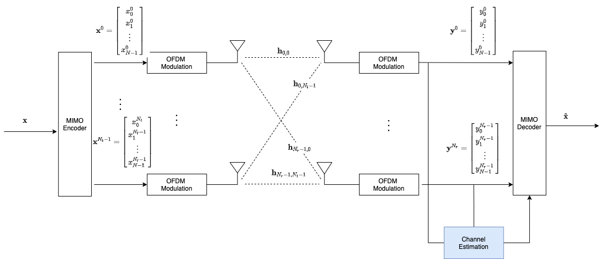
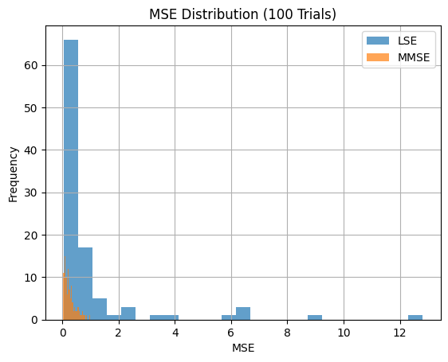
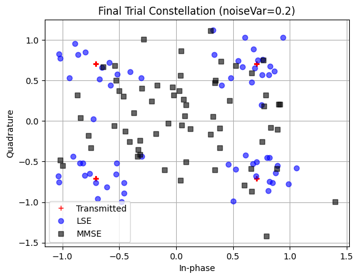

# MIMO-OFDM Channel Estimation: LSE vs MMSE

A self-contained Jupyter notebook demonstrating and comparing two classic channel-estimation methods—Least Squares (LSE) and Minimum Mean Square Error (MMSE)—in a simple MIMO-OFDM link.

## Repository Structure
```
.
├── README.md
├── mimo_ofdm_estimation.ipynb   ← Jupyter notebook with full code & explanations
└── assets/
    ├── block_diagram.png        ← System block-diagram graphic
    ├── mse_histogram.png        ← Histogram of MSE across trials
    └── constellation_plot.png   ← Final-trial QPSK constellation
```

## 📂 Requirements
- Python 3.7+
- NumPy
- Matplotlib
- Jupyter Notebook or JupyterLab

Install dependencies:
```bash
pip install numpy matplotlib jupyter
```

## 🚀 Usage
1. **Clone the repo**
   ```bash
git clone https://github.com/your-username/mimo-ofdm-channel-estimation.git
cd mimo-ofdm-channel-estimation
```
2. **Launch** the notebook:
   ```bash
jupyter notebook mimo_ofdm_estimation.ipynb
```
3. **Run** all cells in order. The notebook is organized as follows:
   1. System parameters (FFT size, CP, antennas, taps, noise, pilots, QPSK, trials)
   2. Channel estimation routines (LSE/MMSE)
   3. Single-trial OFDM simulation (mapping, IFFT/CP, channel, noise, FFT, estimation, equalization, MSE)
   4. Monte Carlo (100 trials): mean & median MSE
   5. Histogram of MSE distribution
   6. Final-trial constellation plot

## 📝 Block Diagram


This diagram shows:
1. **MIMO Encoder** ➔ QPSK mapping + pilot insertion
2. **OFDM Modulator** ➔ IFFT + cyclic prefix
3. **MIMO Channel** ➔ Rayleigh fading taps + AWGN
4. **OFDM Demodulator** ➔ CP removal + FFT
5. **Channel Estimation** ➔ LSE or MMSE using pilots
6. **MIMO Decoder** ➔ Per-subcarrier equalization
7. **MSE Computation** ➔ Compare equalized vs. transmitted symbols

## 📈 Example Results

### 📊 Mean vs. Median MSE


This histogram shows the distribution of MSE over multiple trials. MMSE offers more consistent performance and fewer extreme outliers compared to LSE.

### ✳️ Constellation Plot


Final-trial QPSK constellation after channel estimation and equalization using:
- LSE (more spread)
- MMSE (tighter, closer to ground truth)

## 📄 License
This project is released under the MIT License. See [LICENSE](LICENSE) for details.

## 👤 Author
Mohammad Erfan Hasasni · m_erfan_h78@yahoo.com · [GitHub @PixelErfan]
